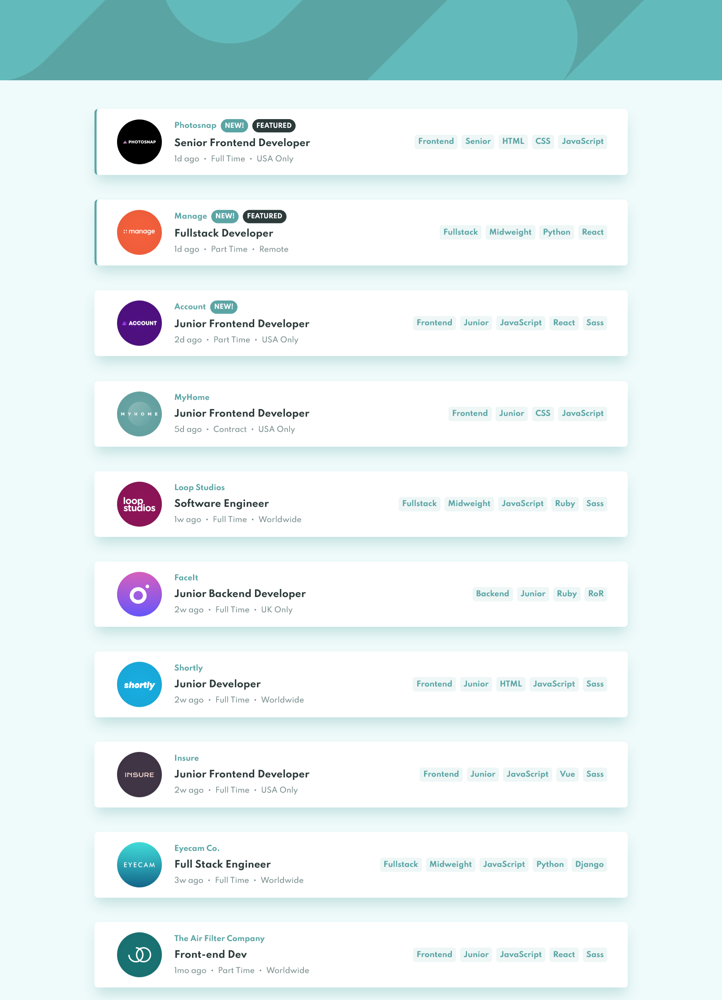

# Frontend Mentor - Job listings with filtering solution

This is a solution to the [Job listings with filtering challenge on Frontend Mentor](https://www.frontendmentor.io/challenges/job-listings-with-filtering-ivstIPCt). Frontend Mentor challenges help you improve your coding skills by building realistic projects.

## Table of contents

- [Overview](#overview)
  - [The challenge](#the-challenge)
  - [Screenshot](#screenshot)
  - [Links](#links)
- [My process](#my-process)
  - [Built with](#built-with)
  - [What I learned](#what-i-learned)
  - [Continued development](#continued-development)
- [Author](#author)

## Overview

### The challenge

Users should be able to:

- View the optimal layout for the site depending on their device's screen size
- See hover states for all interactive elements on the page
- Filter job listings based on the categories

### Screenshot

### Links

- Solution URL: [https://github.com/notanut/job-listings-app.git](https://github.com/notanut/job-listings-app.git)
- Live Site URL: [https://notanut.github.io/job-listings-app/](https://notanut.github.io/job-listings-app/)

## My process

### Built with

- [React](https://reactjs.org/) - JS library
- SCSS
- Flexbox

### What I learned

I learn how to deal with array, especially with the every() and includes() method.

### Continued development

I wanna get more comfortable with react. Maybe I should try NextJS and Typescript.

## Author

- Website - [Natasya](projects-nat.netlify.app/)
- Frontend Mentor - [@notanut](https://www.frontendmentor.io/profile/notanut)
